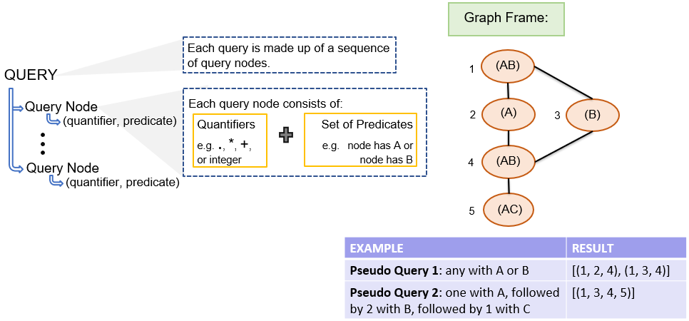

Hatchet offers multiple interfaces to define queries with different trade-offs to verbosity and expressiveness. An entire catalog of queries, use cases, categories and capabilities can be found [here](https://docs.google.com/spreadsheets/d/1fKNlHmDJdDbnE4jyMcaFqdnw6ZSaexgm33rOcVAj0do/edit#gid=0).

Hatchet query language consumes a GraphFrame and a sequence of queries. Each query can comprise a **predicate** and a **quantifier**. Hatchet query language finds all **matching paths** from a provided GraphFrame. For example, in Fig.2, for the query (any with A or B), the output would comprise of 2 paths, [1, 2, 4] and [1, 3, 4].

**Figure 2**: A diagram to provide an overview of queries and an example of how queries filter GraphFrames.